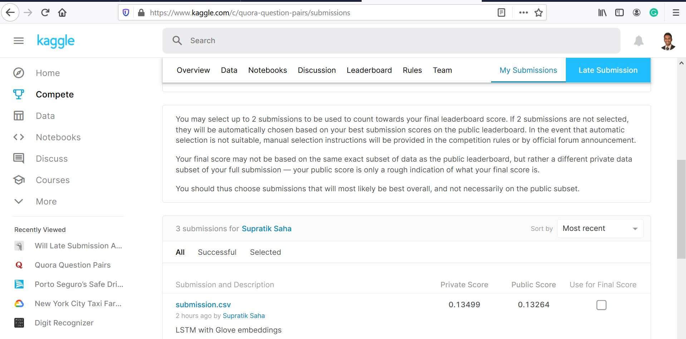

# Kaggle Quora Question Pairs Competition Solution

## Kaggle Competition link

https://www.kaggle.com/c/quora-question-pairs

## Submission Details

My submission had a log loss score of 0.13499 on the private leader board 
and 0.13264 on the public leader board

On the private leader board this translates to a rank of 38 out of 3304 submissions 

This ranks in about top 1% of submissions

# Steps to run project code

## Packages to be installed

Following packages specified in requirements.txt file need to be installed
numpy
pandas
sklearn
keras
nltk
distance
fuzzywuzzy
networkx

## Folders needed to run code

Create folders named data and predictions in the project directory

## Download Competition Data

Download the competition data files from [Kaggle Competition Data Link](https://www.kaggle.com/c/quora-question-pairs/data) and place them in the data folder

## Download Glove Embedding Vector

Download the glove vector into project directory [Pre-Trained Glove Word Vector](https://nlp.stanford.edu/projects/glove)
 
## Running Code

Run the \_\_main__.py file. It is advised to run the code in pieces. For reference, it took me about about 2 days on my HP Spectre i5

# Model

- Model uses in total 25 nlp and non-nlp features
- A 10-fold validation strategy was used
- A Glove embedding vector and an LSTM model was used to get predictions
- Rare words in questions were replaced by an invalid word indicator "memento"
- Average ensembling is used to derive final model predictions